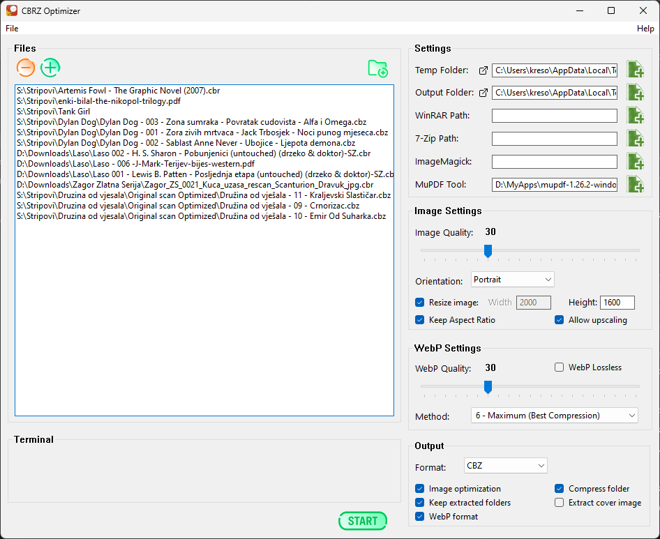

# CBRZoptimizer
[](https://paypal.me/kreso975)
[](https://ko-fi.com/kreso975)


**CBRZoptimizer** is a Windows-native archive extraction and image optimization utility tailored for comic book formats like `.cbz`, `.cbr`. It includes both internal and external optimization tools.

> **Note:** This application is developed as a hobby project.  
> Use at your own risk and for personal/non-commercial purposes.

---

## ✨ Features

- 📦 Extract `.cbz`, `.zip`, `.cbr`, `.rar` archives
- 📁 Folder support:
  - Convert entire folders of images into comic archives (`.cbz`, `.cbr`)
  - Optimize folders of images without archiving
- 📄 Bidirectional PDF support:
  - Convert `.cbz`, `.cbr`, `.zip`, `.rar` archives into `.pdf`
  - Convert `.pdf` files into optimized comic archives (`.cbz`, `.cbr`)
- 🧰 Uses built-in [MiniZ](https://github.com/richgel999/miniz) for ZIP/CBZ handling
- 📂 Automatically flattens nested image folders
- 🖼️ Image optimization with:
  - Internal [STB Image](https://github.com/nothings/stb)
  - External [ImageMagick](https://imagemagick.org/) if configured
- 🧵 Multithreaded image optimization (STB internal)
- 🗂️ Handles UTF-8 and special characters in paths
- 🛠️ Configurable via `config.ini`
- 📦 Optional use of [7-Zip](https://www.7-zip.org/) for ZIP/CBZ extraction and compression

---

## 🚀 Getting Started

1. **Clone the repository**

   ```bash
   git clone https://github.com/kreso975/CBRZoptimizer.git
   ```
2. **Build the project** in Visual Studio

3. **Configure your settings** in `config.ini`:

   - Input/output folders
   - Optional tools:
   - [WinRAR](https://www.win-rar.com/) for `.cbr`, `.rar` support
   - [7-Zip CLI](https://www.7-zip.org/) for `.zip`, `.cbz` extraction and compression
   - [MuPDF CLI](https://mupdf.com/) for PDF creation from archives and PDF extraction
   - [ImageMagick CLI](https://imagemagick.org/script/download.php) for advanced image optimization

---

## ⚙️ Requirements

- Windows 10 or newer
- Optional: [WinRAR](https://www.win-rar.com/) for `.cbr`, `.rar` support
- Optional: [7-Zip CLI](https://www.7-zip.org/) for `.zip`, `.cbz` support
- Optional: [MuPDF CLI](https://mupdf.com/) for `.pdf` generation
- Optional: [ImageMagick CLI](https://imagemagick.org/script/download.php) for advanced image optimization

---

## 🧪 Usage Notes

- Extracted archives are unpacked to the `TMP_FOLDER`
- Final output files are saved in the `OUTPUT_FOLDER`
- STB fallback is used automatically when ImageMagick is unavailable
- PDF creation supports mixed image formats (`.jpg`, `.png`, `.bmp`, `.tif`) and preserves alphabetical page order
- 7-Zip is used for ZIP/CBZ extraction and compression if configured
- Archives (`.cbz`, `.cbr`, `.zip`, `.rar`) can be directly converted to `.pdf` if MuPDF is configured
- PDF files can be extracted into images and re-archived as `.cbz`, `.cbr`, or converted back to `.pdf`

---

## 🧾 License

This project is licensed under the [Apache License 2.0](LICENSE).

---

> 🖼️ Extract. Optimize. Rebuild.  
> **CBRZoptimizer** makes comic archives clean, fast, and Unicode-proof.

---

> **Disclaimer:**  
> This software is provided as-is, with no warranty.  
> It is intended for personal and non-commercial purposes.

## Screenshots of GUI  
  
**Dashboard**  
  
<div style="display: flex; justify-content: center;">  </div>
